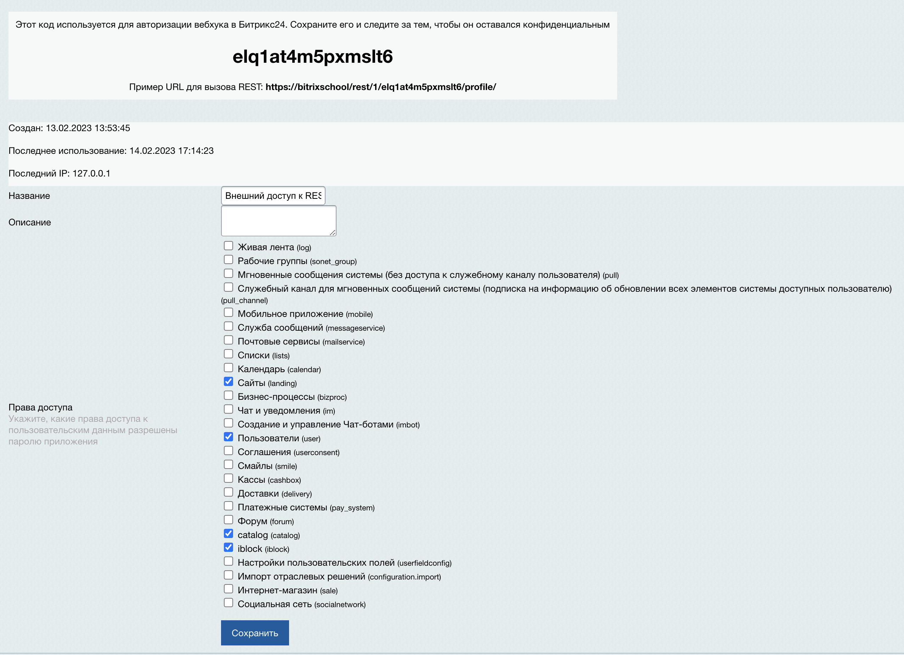

## Разворачивать на linux (Ubuntu, Alpine)
Установить себе docker
````bash
apt install docker*
````
1. ### Клонировать себе репозиторий
```bash
git clone https://github.com/MShiba264/next.git
````
2. ### Папки и файл Битрикс
```
mkdir -p /var/www/bitrix && \
cd /var/www/bitrix && \
wget http://www.1c-bitrix.ru/download/scripts/bitrixsetup.php && \
cd /var/www/ && \
cd /var/ && chmod -R 775 www/ && chown -R root:www-data www/ && \
```
3. ### Скопировать .env_template в .env
````bash
cp -f .env_template .env
````
4. ### Запустить docker
````bash
docker-compose up -d
````
5. ### Установить битрикс с помощью браузера по пути:
#### hostname/bitrixsetup.php

Использовать в качестве данных для базы:
````
Сервер: db
Имя пользователя: bitrix
Пароль: 123
Имя БД: bitrix
Тип БД: innodb
````
Все параметры задаются в .env_template

6. ### После установки скопировать папку rest-hook из репозитория в /var/www/bitrix/
По ссылке ниже инструкция по настройке REST API в БУС:
https://dev.1c-bitrix.ru/community/webdev/user/4580532/blog/42206/
````bash
mkdir rest-hook /var/www/bitrix/
````
По умолчанию в БУС нет нормального интерфейса для взаимодействия с REST API
Для его активации добавить в urlrewrite.php
````bash
99 => 
  array (
    'CONDITION' => '#^/rest-hook/#',
    'RULE' => '',
    'ID' => 'bitrix:rest.hook',
    'PATH' => '/rest-hook/index.php',
    'SORT' => 100,
  ),
````
После вышеперечисленных манипуляций по адресу /rest-hook/ap/0/ будет доступна форма создания входящего вебхука.

7. Создать новый вебхук, выставить необходимые сущности битрикса, доступные по REST API.
   
8. В pages/index.js можно посмотреть пример Get-запроса к элементу инфоблока (по умолчанию закомментировано для проверки работспособности развёртки).
#### getServerSideProps
````
const res = await fetch('https://bitrixschool/rest/1/elq1at4m5pxmslt6/iblock.element.get.json?iblockId=44&elementId=452&select[0]=ID&select[1]=NAME&select[2]=MORE_PHOTO', {
      method: 'GET',
               agent
     }
````